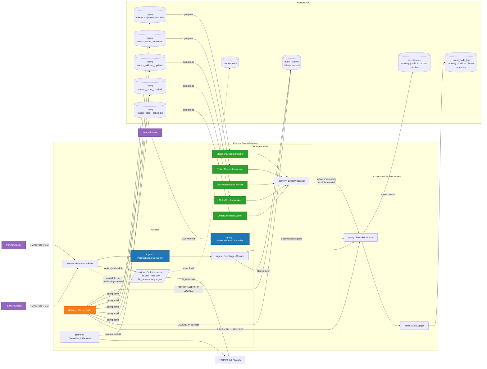
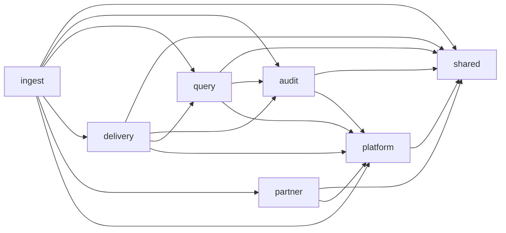

# System overview

High-level component diagram of the Partner Event Gateway, organized by
modular-monolith feature module. The dashed boundary is the deployment unit
in `CONSUMER_ALL` (Stage 1) mode — everything inside runs in one JVM. In
Stage 2 mode, the API role and each consumer role run in separate
Deployments using the same image.

## Module-level dependency direction

The arrows above are runtime data flow. The compile-time dependency direction
between modules is much simpler:

`shared` has no dependencies; `audit` depends only on `shared` + `platform`.
Every feature module is consumable independently — Stage 2 deploys API pods
with `ingest` + `query` + `partner` and consumer pods with `delivery`. Both
roles include `audit` and `platform`.

## Notes

- **`PartnerAuthFilter`** sits in front of partner endpoints only. Internal
  endpoints bypass it (per case spec — internal user auth is out of scope).
- **In-memory partner cache** (`PartnerCacheConfig`): per-pod Caffeine cache
  fronting `PartnerRepository`. `expireAfterWrite=60s`, `maximumSize=10_000`,
  populated on miss via `partners::findById`. On HMAC verify failure the
  filter invalidates the entry, reloads from `partners`, and retries once —
  this absorbs secret-rotation windows without operator intervention. Stats
  are exposed as `peg.partner_cache.size` and `peg.partner_cache.hit_ratio`
  gauges to Prometheus.
- **`OutboxPoller`** runs only on pods with the API runtime role (see
  `RuntimeProperties.runsOutboxPoller()`). Multiple API pods coordinate via
  `FOR UPDATE SKIP LOCKED`.
- **`OutboxPoller` deletes outbox rows on successful send.** The events table
  is the audit source of truth, not the outbox.
- **`AuditLogger`** is invoked by `EventRepository` inside every state-transition
  method, so audit writes are atomic with the operational write.
- **`QueueDepthExporter`** runs only on API pods so there's one source of
  truth for queue-depth metrics, not one per consumer pod.
- The 5 consumer workers run in the same JVM in `CONSUMER_ALL` mode. In
  Stage 2 each one runs in its own Deployment, scaled independently by KEDA
  against its queue's depth.
