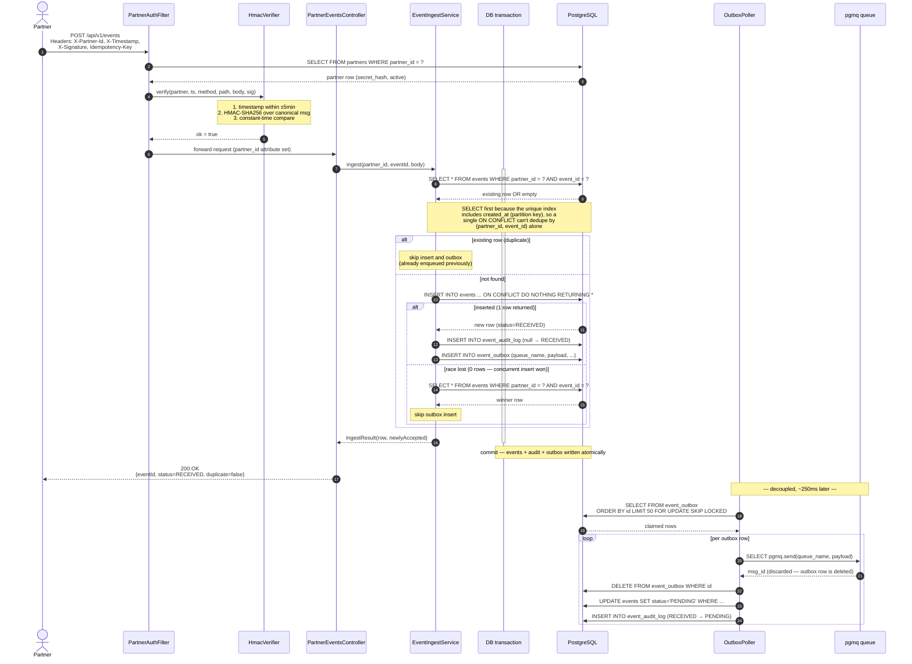

# Sequence: Event submission

End-to-end flow from partner POST through queue delivery. The dotted return arrow at the
top happens before the queue write — the partner gets their 200 OK as soon as the event
is durably committed to Postgres, not after pgmq has accepted the message.

## Idempotency — duplicate path

When a partner retries the same `Idempotency-Key`, the initial `SELECT` by
`(partner_id, event_id)` finds the existing row and returns it without attempting an
`INSERT`. The outbox insert is skipped — there's already a row from the first
submission, sent or not. The response is 200 with `duplicate=true` and the original
event's current status (could be RECEIVED, PENDING, PROCESSING, PROCESSED, or FAILED).

The `ON CONFLICT DO NOTHING` clause on the `INSERT` is the backstop for the rare race
where two concurrent first-time submissions both pass the `SELECT`: the loser gets
zero rows back and re-`SELECT`s to read the winner.

The partner sees their retry succeed without ever knowing whether the original made it.
That's the whole point.

## Crash points and recovery

| When | What happens |
|---|---|
| HMAC fails | Filter throws 401, no DB writes |
| API crashes after `events` insert, before `outbox` insert | All of `events` + audit + `outbox` rolled back (same transaction) |
| Two concurrent first-time submissions race past the initial `SELECT` | Loser gets `rows = 0` from `INSERT`, re-`SELECT`s the winner, skips outbox |
| API crashes after commit, before response | Partner retries → idempotency catches it |
| Outbox poller crashes mid-batch | `FOR UPDATE` releases locks; another poller picks up next tick |
| `pgmq.send` fails | Outbox row retains, `attempts` increments, retried next tick |
| Postgres crashes | Both writes either both committed or both lost (atomic) |
