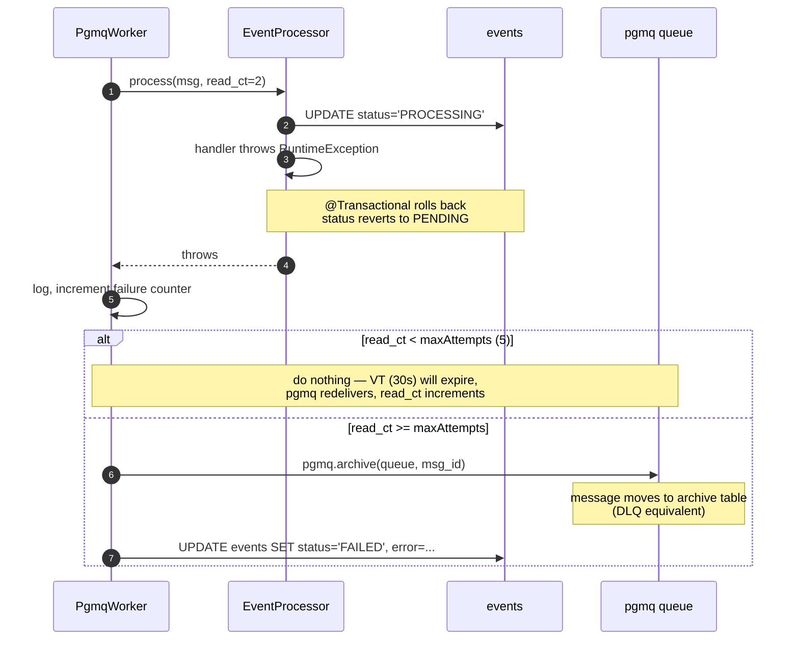

# Sequence: Event consumption

What happens after the outbox poller has put a message into pgmq. Each worker
runs a self-paced loop on a virtual thread; each batch is fanned out across
virtual threads bounded by a per-worker semaphore.

```mermaid
sequenceDiagram
    autonumber
    participant Loop as Worker loop (VT)
    participant W as PgmqWorker (e.g. OrderCreatedWorker)
    participant Sem as Semaphore (concurrency=8)
    participant VT as Virtual thread (one per message)
    participant PGMQ as pgmq.events_order_created
    participant EP as EventProcessor
    participant DB as events table

    Loop->>W: pollOnce()
    W->>PGMQ: SELECT pgmq.read(queue, vt=30s, qty=batch-size)
    PGMQ-->>W: batch [msg_1 ... msg_N]<br/>read_ct increments per msg

    par fan out (up to 8 concurrent)
        W->>VT: submit msg_1
        VT->>Sem: acquire()
        Sem-->>VT: permit
        VT->>EP: process(message_1)
        activate EP
        EP->>DB: UPDATE events SET status='PROCESSING'<br/>WHERE status IN ('PENDING','PROCESSING')
        DB-->>EP: rows updated
        alt rows == 1 (claimed)
            EP->>EP: dispatch by event_type
            Note over EP: handler runs<br/>(may call downstream services)
            EP->>DB: UPDATE events SET status='PROCESSED', processed_at=NOW()
        else rows == 0 (already terminal)
            Note over EP: silently skip<br/>(idempotent — already handled)
        end
        deactivate EP
        VT->>PGMQ: SELECT pgmq.delete(queue, msg_id_1)
        VT->>Sem: release()
    and
        W->>VT: submit msg_2
        Note over VT: same flow as msg_1
    and
        W->>VT: ... up to N messages,<br/>at most 8 holding semaphore at once
    end

    W->>W: CompletableFuture.allOf(...).orTimeout(VT-5s).join()
    W-->>Loop: returns batch.size()
    alt batch was full (size == batch-size)
        Note over Loop: sleep busy-poll-interval-ms (20ms),<br/>queue likely has more
    else batch was partial or empty
        Note over Loop: sleep poll-interval-ms (500ms),<br/>back off
    end
    Loop->>W: pollOnce()  (next iteration)
```

**Work-conserving loop.** The worker never waits the full poll interval while
the queue is hot — only after a partial/empty batch does it back off. Under
load, effective cycle = `batch_processing_time + 20 ms`, not 500 ms.

## What happens if the handler throws



## Visibility timeout interaction

The `vt=30s` argument to `pgmq.read` makes the message invisible to other workers for
30s. If processing succeeds within 30s, `pgmq.delete` removes it permanently. If
processing exceeds 30s (or the worker dies), the message reappears for redelivery.

The batch deadline is `VT - 5s = 25s` via `CompletableFuture.allOf().orTimeout(25, SECONDS)`.
On timeout we don't cancel in-flight tasks — letting them finish their delete/archive
calls is safer than risking double-delete or partial state.

## Why the state filter accepts both PENDING and PROCESSING

`tryMarkProcessing` updates `WHERE status IN ('PENDING', 'PROCESSING')`. Why allow
`PROCESSING → PROCESSING`?

A worker that crashes after `UPDATE status='PROCESSING'` but before completion leaves
the row in PROCESSING. The transaction has rolled back any *handler* changes, but the
status update was its own UPDATE — wait, no, actually `process` is `@Transactional`, so
the status update would also roll back to PENDING.

But there's still a path where PROCESSING persists: if the JVM SIGKILLs after the
transaction commits but before the worker calls `pgmq.delete`. In that window, the
events row is PROCESSED (or FAILED) on disk but pgmq doesn't know. On next redelivery,
`tryMarkProcessing` returns 0 rows updated (status is PROCESSED), and the worker
silently skips and deletes the message. So actually, allowing `PROCESSING → PROCESSING`
is mostly defensive — handles the edge case where a crash leaves PROCESSING in DB
without rolling back.

## DLQ inspection

```sql
-- See what's in the DLQ for a specific event type
SELECT * FROM pgmq.a_events_order_created
ORDER BY archived_at DESC
LIMIT 50;

-- Cross-reference with events table to see the failure reason
SELECT e.*
FROM events e
WHERE e.status = 'FAILED'
ORDER BY e.processed_at DESC
LIMIT 50;
```

A failed event has its row in BOTH places — the pgmq archive (the original message)
and the events table with `status=FAILED, error='...'`. Operations can replay by
re-inserting into `event_outbox` from the archive record.
