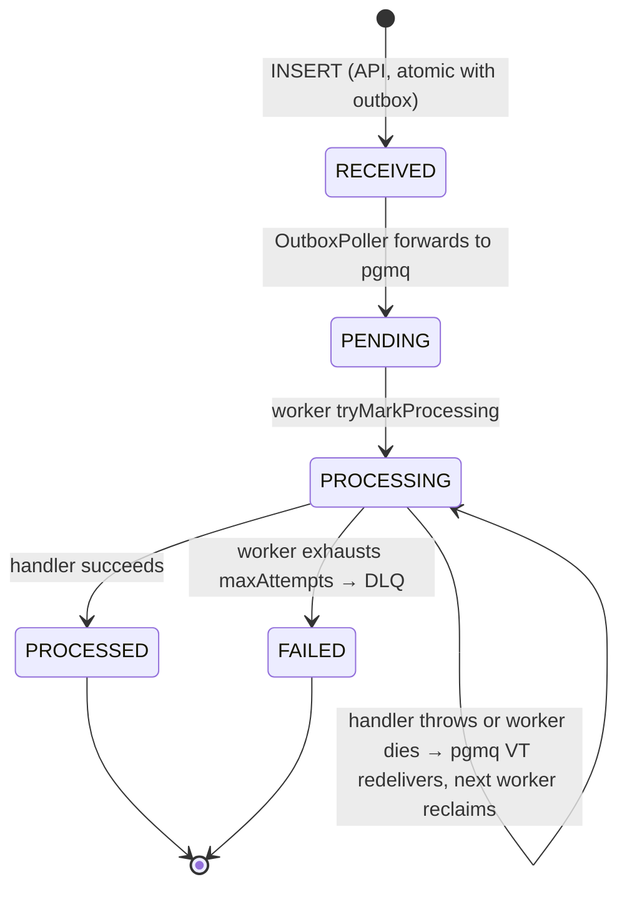

# Event lifecycle state machine

The `events.status` column transitions through these states. The unique constraint on
`(partner_id, event_id)` plus the atomic UPDATE-with-WHERE-status pattern means
concurrent workers can never advance the same row twice.



## State semantics

| State | Meaning | Set by |
|---|---|---|
| `RECEIVED` | API committed both the events row and an outbox row. The message is durable but not yet in pgmq. | API ingest |
| `PENDING` | OutboxPoller has called `pgmq.send` and the message is now in the queue. Awaiting consumer pickup. | OutboxPoller |
| `PROCESSING` | A worker has claimed the row and is actively processing. | Worker (`tryMarkProcessing`) |
| `PROCESSED` | Handler completed successfully; pgmq.delete called. Terminal. | EventProcessor |
| `FAILED` | Worker exhausted `maxAttempts`; archived to pgmq DLQ. Terminal. | Worker |

## Concurrent-update safety

Every state transition is a single `UPDATE … WHERE status IN (...)`. PostgreSQL's
default `READ COMMITTED` isolation guarantees only one of N concurrent updaters wins
the row — the rest see `rows = 0` and their callers handle that as "someone else
already advanced this".

```sql
-- Worker A and Worker B both call tryMarkProcessing concurrently:
UPDATE events SET status = 'PROCESSING'
WHERE partner_id = 'acme' AND event_id = '...'
  AND status IN ('PENDING', 'PROCESSING');

-- Worker A wins, sees rows = 1, proceeds.
-- Worker B sees rows = 0, returns false, drops the message.
```

This is the *only* concurrency control needed for the consume side. `pgmq.read` already
uses `FOR UPDATE SKIP LOCKED` to prevent two workers receiving the same message
simultaneously; the state-filter UPDATE is belt-and-braces against the rare crash
scenarios where pgmq does double-deliver.

## What's NOT a state transition

`Idempotency-Key` retries don't transition state. `INSERT … ON CONFLICT DO NOTHING`
returns 0 rows; the API reads the existing row's current state and returns it. From the
partner's view, every retry returns whatever state the original event has reached so far.

## Every transition is audited

Every state transition writes a row to `event_audit_log` via `AuditLogger.transition`,
inside the same transaction as the operational UPDATE — each transition is its
own short transaction (the claim and the finalize are not bundled together).
This means:

- A successful PROCESSED event has 4 audit rows: `null→RECEIVED`,
  `RECEIVED→PENDING`, `PENDING→PROCESSING`, `PROCESSING→PROCESSED`.
- A FAILED event has 4 audit rows ending in `PROCESSING→FAILED`, with the
  failure reason captured in `event_audit_log.error`.
- A redelivered event whose downstream call failed and recovered on a later
  attempt can have 5+ rows (one or more `PROCESSING→PROCESSING` self-transitions
  before the eventual `PROCESSING→PROCESSED`).

Each operational UPDATE and its audit row commit together or roll back together,
so the audit log never records a transition the events table doesn't reflect.

The audit log retention is 24 months — twice the events table's 12-month
retention. By the time the events row is dropped via partition retention,
its full transition history has typically been consumed for compliance or
forensic purposes; another 12 months of audit retention covers any
late-arriving lookup.

```sql
-- Full lifecycle of a specific event:
SELECT from_status, to_status, actor, error, occurred_at
FROM event_audit_log
WHERE partner_id = 'partner-acme' AND event_id = '...'
ORDER BY occurred_at;

-- All FAILED transitions in the last hour, with reasons:
SELECT partner_id, event_id, error, occurred_at
FROM event_audit_log
WHERE to_status = 'FAILED' AND occurred_at >= NOW() - INTERVAL '1 hour';
```
