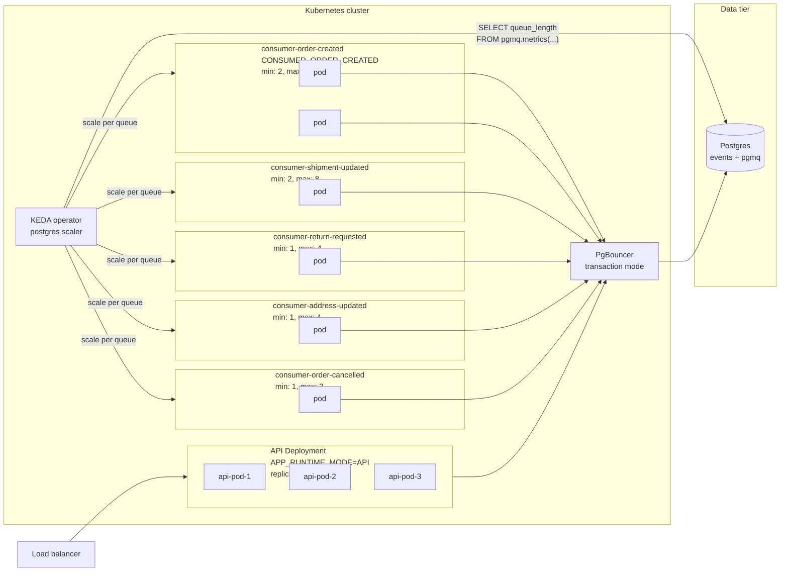

# Stage 2 production topology

In Stage 2, each role from the system overview becomes its own Kubernetes Deployment
driven by `APP_RUNTIME_MODE`. KEDA's postgres scaler reads `pgmq.metrics()` directly
and drives an HPA per consumer Deployment.



## Why PgBouncer

Per-pod Hikari pool is small (6) for transaction-mode compatibility. Total client
connections at peak scale: 3 (API) + 10 (OC) + 8 (SU) + 4 (RR) + 4 (AU) + 3 (OX) =
32 pods × 6 = 192 client connections. PgBouncer multiplexes those onto a small backend
pool (50) at the Postgres side — Postgres never sees more than 50 active connections
regardless of how many consumer pods scale up.

## Why KEDA over native HPA

The natural metric is `pgmq.metrics(queue).queue_length` — already in Postgres. Native
HPA needs metrics from the metrics API (custom-metrics-apiserver or Prometheus
Adapter), which means routing the metric through Prometheus first. KEDA's postgres
scaler queries Postgres directly and emits the right metrics for HPA to consume.
Fewer moving parts.

## What scales how

Each consumer Deployment has its own ScaledObject with thresholds tuned to the event
type's profile:

```yaml
# Higher target for high-volume types
order-created:    targetQueryValue: 500    # scale at 500 pending per pod
shipment-updated: targetQueryValue: 500
# Tighter target for latency-sensitive types
order-cancelled:  targetQueryValue: 50     # scale aggressively on any backlog
```

A traffic burst of OrderCreated events scales `consumer-order-created` from 2 to 10 pods
without touching the other 4 consumer deployments. Cost goes where load goes.

## When one event type still saturates

Per-event-type Deployments and KEDA scaling resolve unbalanced load *across* event
types — one bursty type scales independently of the others. They do not resolve a
single event type whose own queue saturates the per-table contention ceiling. Symptom:
`consumer-order-created` is pinned at `max: 10`, queue depth still climbs, the other
four consumers stay idle.

More pods stop helping because a single pgmq queue is one Postgres heap and one
B-tree. Concurrent writes contend on the tail page regardless of how many consumer
pods read from it — the bottleneck is per-heap, not per-worker.

The lever is to shard *that one* queue into N child queues
(`order_created_shard_0` … `order_created_shard_15`), routing each event by
`hash(partner_id) % N` at insert time. Result: N heaps, N hot tails, writes distribute
by 1/N. KEDA still applies — it now scales 16 ScaledObjects, one per shard queue, with
the same `targetQueryValue`.

`partner_id` (not random, not time) is the right routing key for two reasons. It is
uncorrelated with time, so all shards stay hot in parallel rather than rotating
one-at-a-time the way time-based routing does. And per-partner ordering is
preserved: every event for partner X lands on the same shard, so one consumer
processes that partner's stream in order.

Surgical, not blanket — apply only to the saturated event type; leave the other four
single-queue. When sharding pgmq becomes operationally heavier than the alternative,
that one queue migrates to Kafka. Both options sit at the expensive end of the
[scaling lever inventory](07-scaling-and-tradeoffs.md#3-lever-inventory--cost-ordered).

## Stage 1 sizing for 2K TPS (peak only)

Stage 1 is the single-pod `CONSUMER_ALL` shape: one JVM hosts the API, all 5
consumer workers, and the outbox poller against one Postgres instance. The
default tuning (24 worker slots, `HIKARI_MAX=40`) tops out at ~400 msg/s —
adequate for steady state, far below 2K. With aggressive tuning a single pod
can absorb a **short** 2K-TPS peak, but every dimension of headroom collapses
into one process.

Tuning required (peak only):

| Setting | Default | Peak-2K value | Why |
|---|---|---|---|
| `app.consumer.concurrency.events_order_created` | 8 | 40 | Hot queue takes ~50% of slots |
| `app.consumer.concurrency.events_shipment_updated` | 6 | 24 | |
| `app.consumer.concurrency.events_return_requested` | 4 | 16 | |
| `app.consumer.concurrency.events_address_updated` | 2 | 8 | |
| `app.consumer.concurrency.events_order_cancelled` | 4 | 16 | |
| **Total worker slots** | 24 | **104** | |
| `app.consumer.batch-size.<queue>` | per-queue | 2× concurrency each | Fill semaphore in one read |
| `app.consumer.busy-poll-interval-ms` | 20 | 5 | Recover residual ceiling gap |
| `HIKARI_MAX` | 40 | 120 | 104 workers + ~10 API + 1 outbox + headroom |
| `app.outbox.batch-size` *(after lever #5)* | 50 const | 200 | Single outbox poller is the inbound bottleneck |
| `app.outbox.poll-interval-ms` *(after lever #5)* | 250 const | 100 | 200 msg / 100 ms = 2K msg/s drain |

Throughput math: **104 slots × (1 / handler_latency)** is the consume-side
ceiling. Holds at 2K only if downstream handler p99 ≤ 50 ms. At 100 ms p99 the
ceiling is ~1040 msg/s — Stage 1 can't sustain 2K with realistic latencies.

Why this isn't the recommended shape for sustained 2K TPS:

- **Single JVM, single failure domain.** GC pause, OOM, deploy restart, or a
  single bad downstream pin everything at once. No HA.
- **No surgical scaling.** A burst on `OrderCreated` consumes slots that the
  other 4 queues can't cede; per-queue concurrency caps are static within one
  pod.
- **Connection management overhead at 120+ connections.** Without PgBouncer,
  Postgres holds 120 backends per pod; context switches and per-backend memory
  start to matter.
- **One outbox poller.** The whole inbound side bottlenecks on one loop draining
  the outbox table. In Stage 2, every API pod runs its own poller.

So Stage 1 at 2K is **a deliberate peak-absorption configuration** —
pre-provisioned for short bursts, monitored on Hikari pending-acquire and
queue depth, with a runbook to flip `APP_RUNTIME_MODE` to per-queue Stage 2
if the peak holds for more than a few minutes. For sustained 2K, see Stage 2
below.

## Stage 2 sizing for 2K TPS

A single `CONSUMER_ALL` pod with default settings tops out around 400 msg/s (24
slots × ~20/s at 50 ms handlers). 2K TPS at peak is a **multi-pod target** that
falls out of the per-event-type Deployment split, with each Deployment sized
independently. Worked example, assuming 100 ms p99 handlers and event mix
roughly proportional to the configured concurrency:

| Deployment | Replicas | `concurrency` | `batch-size` | `HIKARI_MAX` | Effective msg/s |
|---|---|---|---|---|---|
| `consumer-order-created` | 5 | 24 | 48 | 30 | ~1100 |
| `consumer-shipment-updated` | 3 | 16 | 32 | 22 | ~440 |
| `consumer-return-requested` | 2 | 12 | 24 | 18 | ~220 |
| `consumer-address-updated` | 2 | 8 | 16 | 14 | ~150 |
| `consumer-order-cancelled` | 2 | 12 | 24 | 18 | ~220 |
| **Total consumer pods** | **14** | | | | **~2130 msg/s** |

Plus 3 API pods × `HIKARI_MAX=12` for ingest at the same TPS (one connection
per request thread + outbox poller). PgBouncer multiplexes the resulting
~350 client connections onto a 50–80 backend pool.

Three configuration items the application code already supports but the
Stage 1 default does not exercise:

- **`app.consumer.batch-size.<queue>`** sized to ~2× per-pod concurrency (the
  semaphore fills in one read with mild pipelining, no head-of-line waste).
- **`app.consumer.busy-poll-interval-ms: 20`** — under load this is the only
  per-cycle overhead. Drop to 5–10 ms for max throughput on very fast handlers.
- **Per-queue runtime mode** (e.g. `APP_RUNTIME_MODE=CONSUMER_ORDER_CREATED`)
  so each pod's Hikari budget isn't shared across all 5 queues.

KEDA still drives autoscaling on `pgmq.queue_length`, so these are **peak**
counts. Steady-state likely runs at `min` replicas. If traffic skews — e.g.
80% of TPS lands on `OrderCreated` — KEDA naturally pushes that one Deployment
toward its `max` while the others stay near `min`. If a single queue still
saturates at 5+ pods (per-heap B-tree contention), shard it by
`hash(partner_id) % N` per
[`07-scaling-and-tradeoffs.md` § 5](07-scaling-and-tradeoffs.md#5-why-partner_id-is-the-right-shard-key-when-l5-is-reached).

Three things worth verifying before committing to 2K:

- **Postgres write capacity** — ~12 K writes/sec at 2K TPS (3–5 writes per
  consumed event + ingest writes). Run `pgbench` on the target instance; WAL
  fsync is the limiter.
- **Real-handler p99** — Resilience4j retries push worst-case latency to ~1.5 s
  on transient downstream failures, which collapses effective concurrency.
  Load-test against the real downstream, not the stub.
- **Outbox drain rate** — currently hardcoded at 200 msg/s per API pod. Promote
  to `app.outbox.*` config (lever #5) to push individual API pods toward 2K
  msg/s drain.

## What doesn't change between Stage 1 and Stage 2

The application code, the Docker image, the database schema, the migrations, the
metrics, the API contract. The only difference is which `APP_RUNTIME_MODE` env var each
pod gets. That's the design property the per-event-type queue split was chosen to enable.

## Stage 2 is documented, not deployed by this submission

Per the case spec, "explain how the solution could support" scaling — the implementation
ships as Stage 1 (`CONSUMER_ALL`), and Stage 2 is the documented evolution path. Helm
charts, KEDA manifests, and PgBouncer configs are not in this repo; they're sketched in
the architecture doc as the natural extension of the deployed code.
