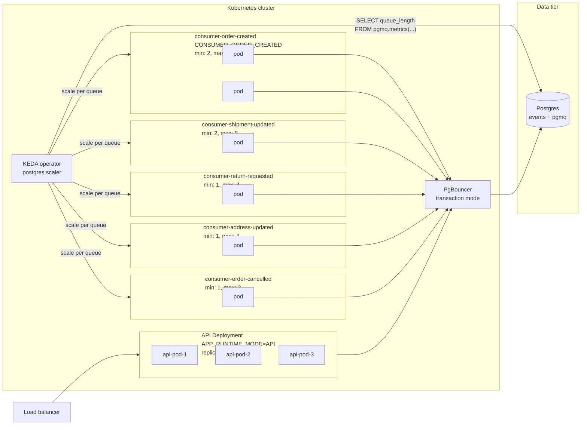

# Stage 2 production topology

In Stage 2, each role from the system overview becomes its own Kubernetes Deployment
driven by `APP_RUNTIME_MODE`. KEDA's postgres scaler reads `pgmq.metrics()` directly
and drives an HPA per consumer Deployment.



## Why PgBouncer

Per-pod Hikari pool is small (6) for transaction-mode compatibility. Total client
connections at peak scale: 3 (API) + 10 (OC) + 8 (SU) + 4 (RR) + 4 (AU) + 3 (OX) =
32 pods × 6 = 192 client connections. PgBouncer multiplexes those onto a small backend
pool (50) at the Postgres side — Postgres never sees more than 50 active connections
regardless of how many consumer pods scale up.

## Why KEDA over native HPA

The natural metric is `pgmq.metrics(queue).queue_length` — already in Postgres. Native
HPA needs metrics from the metrics API (custom-metrics-apiserver or Prometheus
Adapter), which means routing the metric through Prometheus first. KEDA's postgres
scaler queries Postgres directly and emits the right metrics for HPA to consume.
Fewer moving parts.

## What scales how

Each consumer Deployment has its own ScaledObject with thresholds tuned to the event
type's profile:

```yaml
# Higher target for high-volume types
order-created:    targetQueryValue: 500    # scale at 500 pending per pod
shipment-updated: targetQueryValue: 500
# Tighter target for latency-sensitive types
order-cancelled:  targetQueryValue: 50     # scale aggressively on any backlog
```

A traffic burst of OrderCreated events scales `consumer-order-created` from 2 to 10 pods
without touching the other 4 consumer deployments. Cost goes where load goes.

## When one event type still saturates

Per-event-type Deployments and KEDA scaling resolve unbalanced load *across* event
types — one bursty type scales independently of the others. They do not resolve a
single event type whose own queue saturates the per-table contention ceiling. Symptom:
`consumer-order-created` is pinned at `max: 10`, queue depth still climbs, the other
four consumers stay idle.

More pods stop helping because a single pgmq queue is one Postgres heap and one
B-tree. Concurrent writes contend on the tail page regardless of how many consumer
pods read from it — the bottleneck is per-heap, not per-worker.

The lever is to shard *that one* queue into N child queues
(`order_created_shard_0` … `order_created_shard_15`), routing each event by
`hash(partner_id) % N` at insert time. Result: N heaps, N hot tails, writes distribute
by 1/N. KEDA still applies — it now scales 16 ScaledObjects, one per shard queue, with
the same `targetQueryValue`.

`partner_id` (not random, not time) is the right routing key for two reasons. It is
uncorrelated with time, so all shards stay hot in parallel rather than rotating
one-at-a-time the way time-based routing does (see `07-scaling-bottlenecks.md`). And
per-partner ordering is preserved: every event for partner X lands on the same shard,
so one consumer processes that partner's stream in order.

Surgical, not blanket — apply only to the saturated event type; leave the other four
single-queue. When sharding pgmq becomes operationally heavier than the alternative,
that one queue migrates to Kafka (see `09-actual-scaling-bottlenecks.md`, Layer 5).

## What doesn't change between Stage 1 and Stage 2

The application code, the Docker image, the database schema, the migrations, the
metrics, the API contract. The only difference is which `APP_RUNTIME_MODE` env var each
pod gets. That's the design property the per-event-type queue split was chosen to enable.

## Stage 2 is documented, not deployed by this submission

Per the case spec, "explain how the solution could support" scaling — the implementation
ships as Stage 1 (`CONSUMER_ALL`), and Stage 2 is the documented evolution path. Helm
charts, KEDA manifests, and PgBouncer configs are not in this repo; they're sketched in
the architecture doc as the natural extension of the deployed code.
