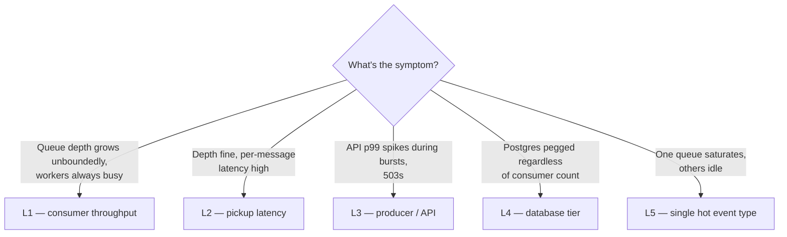
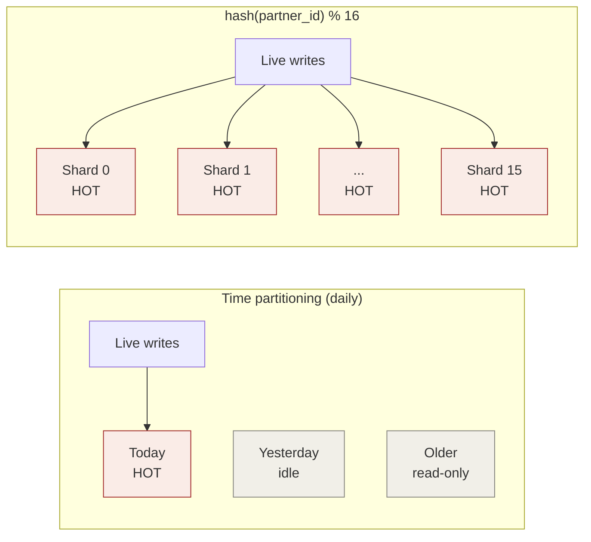

# Scaling and trade-offs

> Companion to [`../ARCHITECTURE.md`](../ARCHITECTURE.md). Captures the operational
> reasoning behind two design choices that shape this submission: the outbox
> pattern and the per-event-type queue topology. Same shape every time:
> **diagnose first, then pick the cheapest lever that targets it**.

The case spec asks for a design that "could support high availability, growing
traffic, and efficient reads/writes" — not a finished horizontal-scale
implementation. This doc walks the levers in cost order and notes which are
already wired in this submission and which are documented evolution paths.

## 1. Outbox vs direct `pgmq.send` — at a glance

ADR-002 in [`../ARCHITECTURE.md`](../ARCHITECTURE.md#adr-002-transactional-outbox-vs-direct-pgmqsend)
gives the long-form rationale. The scorecard:

| Concern | Direct `pgmq.send` | Outbox |
|---|---|---|
| Atomicity with `events` row (same DB) | = same tx | = same tx |
| Durability after API ack | = equivalent | = equivalent |
| API p99 latency | − correlated with queue load | + predictable |
| Lock contention with consumers | − hot pgmq pages | + separate table |
| Behaviour during pgmq incident | − cascading 500s | + partners unaffected |
| Coupling to queue technology | − in the ingest path | + isolated to poller |
| Code complexity | + ~5 lines | − ~100 lines |
| Latency from accept to queue | + immediate | − +1 poll interval |

**Legend:** `+` better · `−` worse · `=` equivalent

> Atomicity is equivalent in a same-database setup. What differs is *what 200 OK
> means to the partner*: direct send promises "the queue accepted it"; outbox
> promises "we have it, you can stop worrying". For B2B traffic the outbox
> contract is what partners actually want, and the +250 ms forwarding latency is
> negligible against typical webhook SLAs.

### Incident shape

At 500 req/s incoming, a 60 s pgmq hiccup means 30 000 events arrive during the
incident:

| | Direct `pgmq.send` | Outbox |
|---|---|---|
| Partners seeing 5xx | **all** | **none** |
| Failed requests | 30 000 | 0 |
| Events durably accepted | 0 | 30 000 |
| Recovery | manual partner retries | poller drains automatically |

## 2. Scaling diagnostic — five layers, five fixes

Most "the queue is slow" tickets are misdiagnosed. The same lever fixes one
layer and fails on another. **Name the symptom first.**

| Layer | Real cause | Try first | Don't reach for |
|---|---|---|---|
| **L1** consumer throughput | per-worker concurrency × replicas below arrival rate, or slow handler | raise `Semaphore`, add replicas, profile handler | hourly partitioning (renames the contention, doesn't divide it) |
| **L2** pickup latency | poll interval (only on idle queues — busy interval already covers loaded queues) | long-polling via `pgmq.read_with_poll` for idle-queue pickup; tune `busy-poll-interval-ms` for hot queues | more pods (latency is per-message) |
| **L3** producer / API | API doing too much per request, or outbox poller behind | outbox (already wired), API replicas, per-partner rate limit | any consumer-side lever |
| **L4** database tier | underlying instance, hostile workload | PgBouncer, read replica, index audit, vacuum tuning | more consumer pods (makes L4 worse) |
| **L5** single hot event type | one pgmq queue is one heap, one B-tree | shard the saturated queue by `hash(partner_id) % N`; eventually swap that one to Kafka | spreading load evenly across all 5 queues — only one is the problem |

## 3. Lever inventory — cost-ordered

Most teams never get past step 4. **Don't reach for #18 when #1 isn't tried.**

| # | Lever | Targets | Status in this repo |
|---|---|---|---|
| 1 | Per-worker `Semaphore` concurrency | L1 | **wired** — `app.consumer.concurrency.<queue>` (`application.yml`) |
| 2 | Add consumer replicas (Stage 2) | L1 | **partial** — `APP_RUNTIME_MODE` switch wired; k8s manifests not in repo |
| 3 | Per-queue `pgmq.read` batch size | L1 | **wired** — `app.consumer.batch-size.<queue>` (sized to ~2× concurrency) |
| 3a | Work-conserving poll loop (busy vs idle interval) | L1, L2 | **wired** — `app.consumer.busy-poll-interval-ms` (20 ms) on full batches, `poll-interval-ms` (500 ms) when partial/empty |
| 4 | Long-polling (`pgmq.read_with_poll`) | L2 (idle queues) | **not wired** — `PgmqWorker.readBatch` calls plain `pgmq.read`; busy interval already covers loaded queues |
| 5 | Faster outbox poll / bigger batch | L3 | **not exposed** — `BATCH_SIZE=50`, `POLL_INTERVAL=250ms` are constants in `OutboxPoller`; would lift to `app.outbox.*`. Stays per-row `pgmq.send` not `send_batch`; see [ADR-011](../ARCHITECTURE.md#adr-011-per-row-pgmqsend-vs-pgmqsend_batch-in-the-outbox-poller) |
| 6 | Profile + optimize per-message handler | L1 | **per-handler** — case-by-case |
| 7 | API replicas (HPA on CPU) | L3 | **partial** — `APP_RUNTIME_MODE=API` wired; HPA manifest not in repo |
| 8 | Per-partner rate limit (token bucket → 429) | L3 | **not wired** — would slot into `PartnerAuthFilter` |
| 9 | Bump `HIKARI_MAX` | L3, L4 | **wired** — env var |
| 10 | KEDA postgres scaler on `pgmq.metrics().queue_length` | L1 autoscale | **partial** — `QueueDepthExporter` publishes gauges; KEDA manifest in [`06-stage2-topology.md`](06-stage2-topology.md), not deployed |
| 11 | Read replica for query API | L4 (read side) | **wired** — opt-in via `REPLICA_DB_URL`; falls back to primary when unset |
| 12 | PgBouncer transaction-mode pooling | L4 | **partial** — JDBC settings already PgBouncer-compatible (`prepareThreshold: 0`, `auto-commit: true`); no PgBouncer service in compose |
| 13 | Index audit + covering indexes | L4 | **per-query** |
| 14 | Vacuum tuning on hot pgmq tables | L4 | **defaults only** |
| 15 | Bigger Postgres instance | L4 | **infra** |
| 16 | Dedicated Postgres for pgmq | L4, blast-radius | **noted**, not deployed |
| 17 | Cold-tier archive of detached partitions to S3 | storage cost | **partial** — `retention_keep_table=true` is set, so partitions detach instead of dropping; the dump-to-S3 job is not implemented |
| 18 | Shard the hot queue by `hash(partner_id) % N` | L5 | **not wired** — surgical, only if one type saturates |
| 19 | Migrate hottest queue to Kafka | L5 | **not wired** — last resort. The outbox is the seam that keeps this swap cheap |
| 20 | Shard the operational DB | L4 ceiling | **not wired** — only at huge scale |

## 4. Partitioning vs sharding — the easy thing to confuse

|  | Time partitioning | Sharding (by partner) |
|---|---|---|
| Routing key | `created_at` — monotonic with time | `hash(partner_id)` — uncorrelated with time |
| Children receiving writes *now* | **1** | **all N** |
| Effect on hot-tail contention | none — moves it, doesn't divide it | scales by **1/N** |
| What it actually solves | retention via `DROP PARTITION`, vacuum-free archives, partition pruning | hot-tail B-tree contention, per-tenant blast radius, per-partner ordering |

> **Time partitioning splits the *history* of writes; sharding splits the
> *concurrent stream* of writes. Contention is a property of concurrency, not
> history.**

If the proposed fix for "the queue is too slow" is "make smaller partitions",
ask: *are concurrent writes spread across more children, or still concentrated
on the latest one?* If concentrated → contention point did not move. If spread
→ that's sharding, regardless of what it's called.

## 5. Why `partner_id` is the right shard key (when L5 is reached)

If one queue saturates and we shard it, the routing key matters:

- **Random** would distribute writes evenly but break per-tenant ordering. A
  partner's events for the same business reference would land on different
  shards and consumers couldn't preserve the partner's intended sequence.
- **Time-based** rotates one shard at a time — same hot-tail problem, just
  rotating around N tables instead of one.
- **`hash(partner_id) % N`** distributes writes evenly *and* keeps every event
  for partner X on the same shard, so one consumer processes that partner's
  stream in order.

Surgical, not blanket: apply only to the saturated event type; leave the other
four single-queue. When sharding pgmq becomes operationally heavier than the
alternative, that one queue migrates to Kafka (lever #19).
