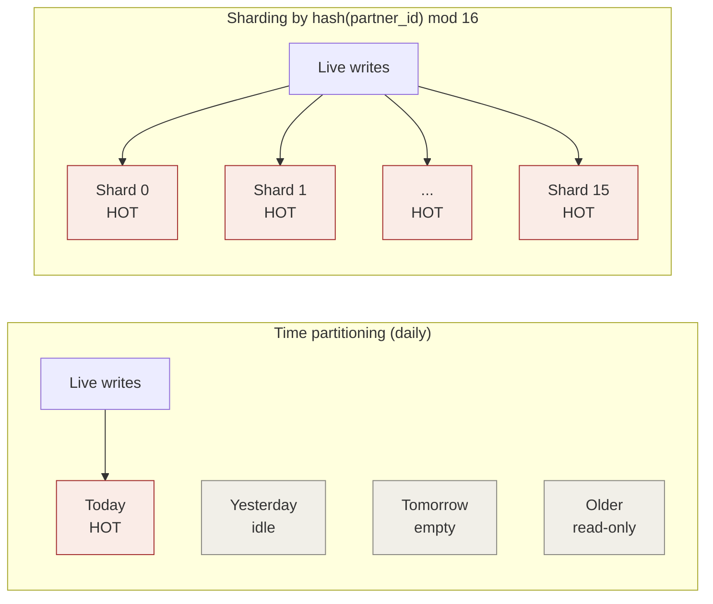

# Scaling bottlenecks

> Why time partitioning solves retention but only partner-level sharding solves throughput contention.

## The five bottlenecks, in the order they appear

As traffic grows, these problems surface roughly in this sequence. Each has a *different* fix; conflating them wastes effort. (See `09-actual-scaling-bottlenecks.md` for the full layer-by-layer "diagnose → fix" matrix.)

1. **Consumer throughput** — queue depth grows unboundedly, workers always busy.
2. **Pickup latency** — depth is fine, but per-message wait is high (a polling-interval problem).
3. **Producer side** — API CPU pegged on ingest during bursts; p99 spikes.
4. **Database tier** — Postgres pegged regardless of consumer count.
5. **Hot single event type** — one queue saturates; the others are idle.

## Why partitioning ≠ sharding

Both partitioning and sharding split a logical table into N children. The difference is **which children receive concurrent writes right now**.

| | Time partitioning | Sharding (by partner) |
|---|---|---|
| Children | 7 (daily) or 24 (hourly) | N (e.g. 16) |
| Routing key | `enqueued_at` — monotonic with time | `hash(partner_id) % N` — uncorrelated with time |
| Children receiving writes *now* | **1** | **all N** |
| Effect on hot-tail contention | none — moves it, doesn't divide it | scales by **1/N** |

Hot-tail lock contention is a function of *concurrent writes per child*, not of total children. Finer time partitioning never fixes it — it just renames where the contention lives.

## What partitioning actually solves

- Cheap retention via `DROP PARTITION` instead of `DELETE`
- Vacuum-free archive partitions (no churn on cold data)
- Backup/restore granularity
- Parallel scans of historical time-range queries

## What sharding actually solves

- Hot-tail B-tree contention
- Page-level lock saturation
- Per-tenant blast radius (one noisy partner doesn't degrade the others)
- Per-partner ordering preserved (all events for partner X land on the same shard)

## Write distribution at 5 000 inserts/sec

The same workload across four strategies — where do writes land?

| Strategy | Children that exist | Children receiving writes *now* | Inserts/sec on hottest child |
|---|---|---|---|
| No partitioning | 1 | 1 | 5 000 |
| Daily partitions | 7 | 1 | 5 000 |
| Hourly partitions | 24 | 1 | 5 000 |
| Shard by partner ÷ 16 | 16 | 16 | ~313 |

Only sharding moves the per-child write rate. The rest leave the hot tail exactly as concentrated as it was.

## The rule

> **Time partitioning splits the *history* of writes; partner sharding splits the *concurrent stream* of writes. Contention is a property of concurrency, not history.**

If the proposed fix for "the queue is too slow" is "make smaller partitions," ask:

- Are concurrent writes spread across more children, or still concentrated on the latest one?
- If concentrated → the contention point did not move.
- If spread → that's sharding, regardless of what you call it.
