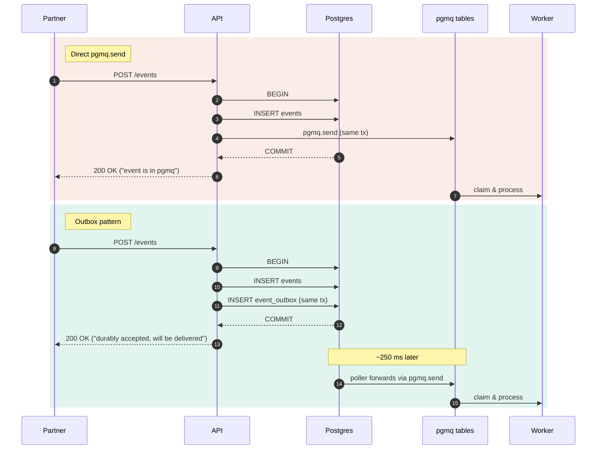

# Outbox vs direct `pgmq.send`

> Atomicity is equivalent in a same-database setup; six operational properties differ.

## What does "200 OK" mean?

| | Direct `pgmq.send` | Outbox |
|---|---|---|
| Meaning of `200 OK` | "The event is in pgmq, ready to be processed." | "The event is durably accepted and will be delivered." |
| Atomicity with `events` row | same DB, same tx | same DB, same tx |
| Forwarding | synchronous | asynchronous, eventually consistent |

Direct `pgmq.send` couples API success to queue health. The outbox decouples them. Atomicity is equivalent — what differs is what your "200 OK" promises to the partner.

### What is identical in both

- Atomicity with the `events` row (same DB, same transaction)
- Durability — both writes survive a JVM crash equally
- No "API said 200 but row missing" failure mode
- Idempotency via `UNIQUE (partner_id, event_id)`

## Six concerns where they differ

### 1. API latency profile

| Direct (`pgmq.send` is PL/pgSQL) | Outbox (plain INSERT) |
|---|---|
| Resolves current partition; may create a new one | Single table, no extension code |
| Inserts into hot `pgmq.q_events_*` | No partition lookup overhead |
| Avg ~1–2 ms; tail spikes when consumers contend | Avg ~0.5 ms with predictable tail |
| Partition-roll moments cause visible tail latency | Independent of pgmq table activity |

> API p99 stays predictable with the outbox because partner-facing latency stops being a function of consumer load.

### 2. Lock contention with consumers

| Direct (same hot pages) | Outbox (disjoint table) |
|---|---|
| Consumers `SELECT … FOR UPDATE SKIP LOCKED` on `q_events_*` | API writes only to `event_outbox` |
| API inserts into the same hot tail of the same B-tree | Consumers never read from `event_outbox` |
| Page-level latches contend at high concurrency | No shared hot pages between producers and consumers |
| API latency correlates with consumer count | Poller reads outbox on its own schedule |

> The hot tail of the outbox is touched by API + poller only; the hot tail of pgmq is touched by poller + consumers only. Two smaller contention domains beat one big one.

### 3. Failure isolation during pgmq incidents

| Direct (cascades to partners) | Outbox (absorbs the incident) |
|---|---|
| pgmq breakage → API request returns 500 | API request still succeeds (only outbox insert) |
| Every partner sees errors until pgmq recovers | Partners get 200, never see the failure |
| Idempotent retries fail too (same root cause) | Events accumulate in `event_outbox` |
| No backlog accumulation — events are simply rejected | Poller drains naturally when pgmq recovers |

> The outbox is a circuit breaker between partner-facing reliability and queue health.

### 4. Coupling to queue technology

| Direct (queue API in ingest path) | Outbox (stable seam) |
|---|---|
| Controller / producer service calls `pgmq.send` directly | API writes queue-agnostic JSON to `event_outbox` |
| Replacing the queue means changing the API code | Only the poller knows about pgmq |
| Highest-risk code, exercised by every partner request | Replacing the queue means changing one background worker |
| Migration requires API redeploy + careful rollout | Lower blast radius, independent deploy cycle |

> The outbox row format becomes the stable contract between "accept" and "deliver". The queue underneath is swappable.

### 5. Backpressure surface

| Direct (no control point) | Outbox (poller is the seam) |
|---|---|
| Each request triggers a queue write | Configurable cadence and batch size |
| Slow queue → slow API | Drop-oldest, prioritize-tier, batch-by-queue policies |
| Overloaded queue → overloaded API | Forward at 1 k/s even if 5 k/s is arriving |
| Rate-limit policy must live upstream | API keeps accepting; backpressure shapes delivery, not ingest |

> A tunable control point appears between accept and deliver. Throttling downstream is just a poller setting.

### 6. Observability of delivery

| Direct (visible only via pgmq) | Outbox (queryable pipeline) |
|---|---|
| No application-level record of "sent at" | `created_at` on every row = API ack moment |
| Can't answer per-message timing without log scraping | Row deletion / `sent_at` = forward moment |
| "Stuck" detection requires pgmq queries + correlation | Stuck rows surface via `WHERE sent_at IS NULL` |
| Per-partner pipeline metrics need custom instrumentation | Per-partner backlog: `GROUP BY partner_id` |

> The outbox is itself a structured, queryable view of the delivery pipeline. No log mining required.

## Summary scorecard

| Concern | Direct `pgmq.send` | Outbox |
|---|---|---|
| Atomicity (same DB) | equivalent | equivalent |
| Durability | equivalent | equivalent |
| API p99 latency | correlated with queue load | predictable |
| Lock contention with consumers | on hot pgmq pages | separate table |
| Behaviour during pgmq incident | cascading 500s | partners unaffected |
| Coupling to queue technology | in the ingest path | isolated to poller |
| Backpressure / rate-limit point | none | poller is the seam |
| Observability of delivery | via pgmq only | application-managed |
| Code complexity | simpler (~5 lines) | more (~100 lines) |
| Latency from accept to queue | immediate | +1 poll interval |

A side-by-side scorecard view also lives in `10-outbox-scorecard.md`.

## Incident simulator — "if pgmq has a 60-second hiccup right now"

At 500 req/s incoming, 60 s outage = 30 000 events arrive during the incident.

| | Direct `pgmq.send` | Outbox |
|---|---|---|
| Partners seeing 500 errors | **all** | **none** |
| Failed requests | 30 000 | 0 |
| Events durably accepted | 0 | 30 000 |
| Recovery | manual partner retries | poller drains automatically |

Generalises to: at *R* req/s for *D* seconds, direct send rejects *R × D* events; outbox accepts all of them and forwards them when pgmq recovers.

## When direct `pgmq.send` is fine

- **Low traffic.** Tens of events/sec, no contention, no partition issues.
- **Tolerant clients.** Partners accept 500s and retry forever.
- **Single-stack forever.** No plans to migrate to Kafka or change queue technology.
- **Internal tools.** Operations team comfortable querying pgmq directly for forensics.

## When the outbox earns its keep

- **Multi-tenant B2B with paying partners.** Partner-facing reliability matters more than ~250 ms forwarding latency.
- **High concurrency.** Consumers and producers contend on the same hot pgmq pages.
- **Future-proof against queue migration.** Outbox is the seam where Kafka can replace pgmq later.
- **SLAs require independent metrics.** "We accepted it" must be measurable separately from "we forwarded it".

## The framing that captures the difference

> Atomicity is the same in both options. What differs is *what API success means*. Direct send promises "everything downstream is healthy right now." Outbox promises "we have it, you can stop worrying." The outbox contract is what B2B partners actually want.
