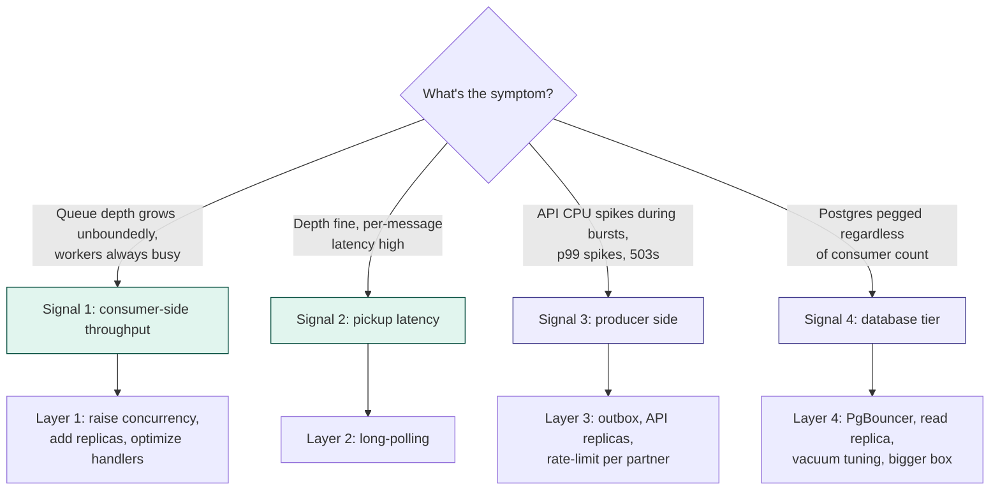

# What solves the actual scaling bottleneck?

> Five bottlenecks in the order they appear, with the right fix for each — and what only *looks* like a fix.

> Most "scaling" problems are misdiagnosed. Hourly partitioning solves a problem people *think* they have but rarely the one they *actually* have. **Diagnose first; pick the lever the diagnosis names.**

> Looking for the consolidated lever inventory — every option in one place, with current implementation status? See [`11-scaling-levers.md`](11-scaling-levers.md). This doc is the diagnostic; that one is the catalogue.

## Diagnose first

Before reaching for any lever, ask which of these symptoms you actually have. Each maps to a different fix; mixing them up wastes effort.

> **The single question that routes you to the right layer:** *what concurrent operation is bottlenecked, and what physical resource is it bottlenecked on?*

## The five layers — symptom, real cause, fix

### Layer 1 — Consumer throughput

- **Symptom.** Queue depth grows unboundedly. Workers always busy. More polling does not help.
- **Real cause.** Per-worker concurrency × replica count below arrival rate, or handler too slow per message.

| Solves it | Doesn't solve it |
|---|---|
| Raise per-worker `Semaphore` concurrency (free) | Hourly partitioning — does not change throughput, just renames where rows land |
| Add consumer replicas — `FOR UPDATE SKIP LOCKED` coordinates them | Bigger Postgres — workers are the constraint, not the DB |
| Profile and reduce time-per-message in handlers (biggest win) | More queues for the same event type — still one workload, just split |
| Increase `pgmq.read` batch size | |

### Layer 2 — Pickup latency

- **Symptom.** Throughput keeps up. But per-message latency from publish to processed is seconds when it should be milliseconds.
- **Real cause.** Polling interval. With `fixedDelay = 500 ms`, a message arriving 1 ms after a poll waits 499 ms for the next one.

| Solves it | Doesn't solve it |
|---|---|
| Long-polling via `pgmq.read_with_poll` — drops latency to tens of ms | Adding more consumer pods — latency is per-message, more pods don't help individuals |
| Dedicated consumer connection pool so long-poll does not starve API | Partition tuning of any kind |
| Shorter `fixedDelay` (cheap stopgap, more idle queries) | |

### Layer 3 — Producer side (API ingest)

- **Symptom.** API p99 spikes during traffic bursts. Pod CPU pegged. 503s under load.
- **Real cause.** API doing too much per request, or the outbox poller cannot keep up so writes accumulate.

| Solves it | Doesn't solve it |
|---|---|
| Async ack via outbox — partner waits only for `events` + `outbox` commit | Anything queue-related — queue is not the bottleneck if API is |
| Add API replicas (stateless, trivial via HPA on CPU) | Adding consumer pods — consumers do not affect API latency |
| Faster outbox draining — bigger batch, shorter interval | |
| Bump Hikari connection pool to absorb bursts | |
| Per-partner rate limit — token bucket at auth filter, 429 with Retry-After | |

### Layer 4 — Database tier

- **Symptom.** Postgres CPU pegged. WAL writes saturating disk. Replicas falling behind. Connection pool exhausted.
- **Real cause.** Underlying instance too small, or workload pattern hostile (huge JSONB, missing indexes, table bloat, lock contention).

| Solves it | Doesn't solve it |
|---|---|
| PgBouncer transaction-mode pooling — multiplexes thousands of clients onto small backend pool | Hourly partitioning — smaller partitions don't reduce total work, just spread it |
| Read replica for the query API path — different working set, no cache contention | More consumer pods — more pods = more DB load, makes it worse |
| Index audit — `EXPLAIN ANALYZE` on actual query patterns, add covering indexes | |
| Vacuum tuning on hot pgmq tables — `autovacuum_vacuum_scale_factor=0.05` | |
| Bigger instance — when all the above is done | |
| Dedicated Postgres instance for pgmq — stop pgmq churn from competing for `shared_buffers` | |

### Layer 5 — Single hot event type (the escape hatch)

- **Symptom.** One queue saturates at 10 k+ msg/sec sustained even with everything tuned. Other 4 queues idle.
- **Real cause.** A single pgmq queue is a single Postgres heap and B-tree. Per-table contention ceiling is around tens of thousands of msg/sec.

| Solves it | Doesn't solve it |
|---|---|
| **Shard the hot queue by `hash(partner_id)`** — 16 separate heaps, 16 hot tails, distribute by uncorrelated key | Anything that spreads load across all 5 queues equally — only one is the problem |
| Surgical, not blanket — apply to the saturated type only, leave others single | More aggressive time partitioning — concurrent writes still target the latest partition |
| Migrate that one queue to Kafka — when sharding pgmq becomes operationally heavier than Kafka | |

## The cost ladder — order of escalation

Cheapest first. Most teams never get past step 4 because steps 1–4 buy enough headroom for years.

| # | Action | Cost |
|---|---|---|
| 1 | Increase per-worker concurrency | config change |
| 2 | Add consumer replicas | config change |
| 3 | Long-polling | small code change |
| 4 | Profile and optimize handlers | real work, biggest wins |
| 5 | Read replica for query API | infra change |
| 6 | PgBouncer connection multiplexing | infra change |
| 7 | Per-partner rate limiting | small code change |
| 8 | Vacuum tuning on hot pgmq tables | Postgres config |
| 9 | Bigger Postgres instance | cost |
| 10 | Dedicated Postgres for pgmq | infra |
| 11 | Shard the saturated event type | real refactor |
| 12 | Migrate hottest queue to Kafka | significant work |

## The partitioning myth

Partitioning is for **retention**, not throughput.

| What partitioning solves | What partitioning does NOT solve |
|---|---|
| Cheap retention via `DROP PARTITION` instead of `DELETE` | Hot-tail B-tree contention (writes still target one child) |
| Vacuum-free archive partitions (no churn on cold data) | Page-level lock saturation on the current partition |
| Backup/restore granularity | Per-tenant blast radius from a noisy neighbour |
| Parallel scans on historical time-range queries | Single-queue throughput ceiling |

> Time partitioning splits the *history* of writes; partner sharding splits the *concurrent stream* of writes. Contention is a property of concurrency, not history.

### Quick mental check

If your fix for "the queue is too slow" is "make smaller partitions," ask:

- Are concurrent writes spread across more children, or concentrated on the latest one?
- If concentrated → the contention point did not move.
- If spread → you are sharding, not partitioning, regardless of what you call it.

(See `07-scaling-bottlenecks.md` for the partitioning-vs-sharding visual breakdown.)
